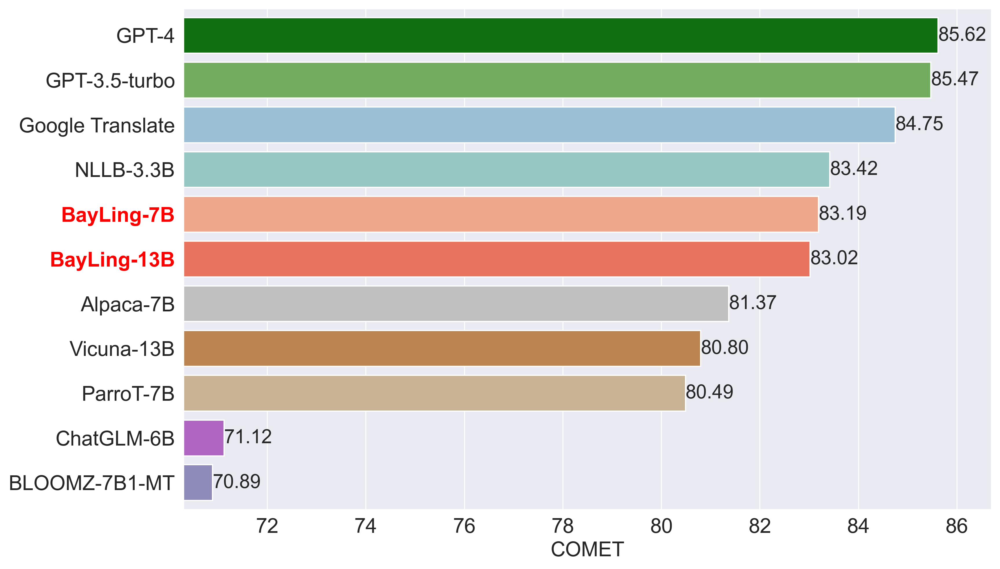
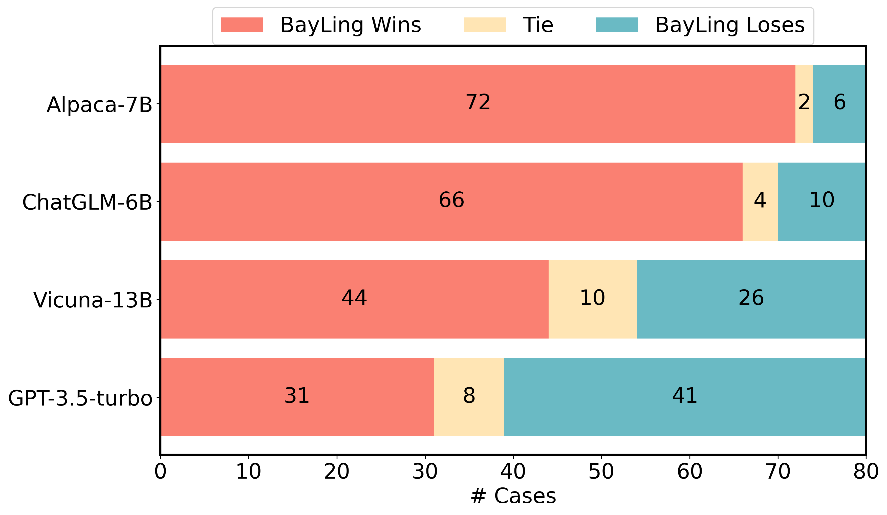
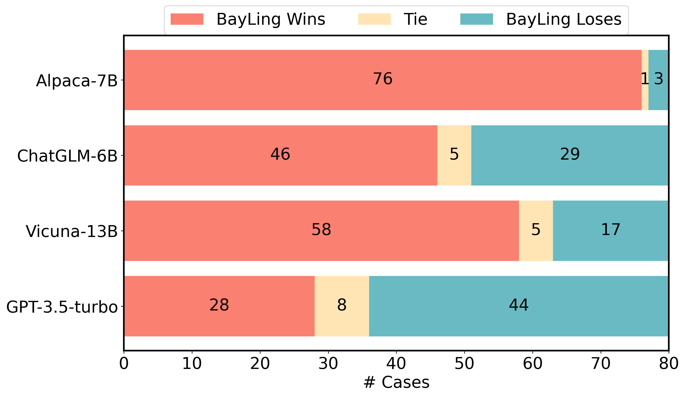
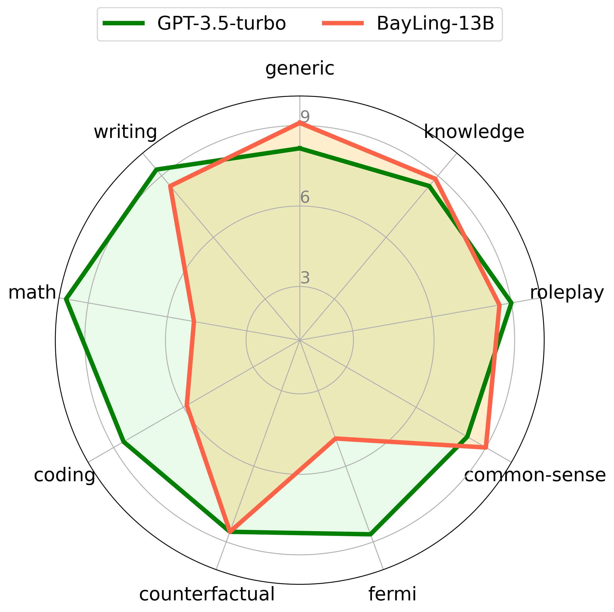
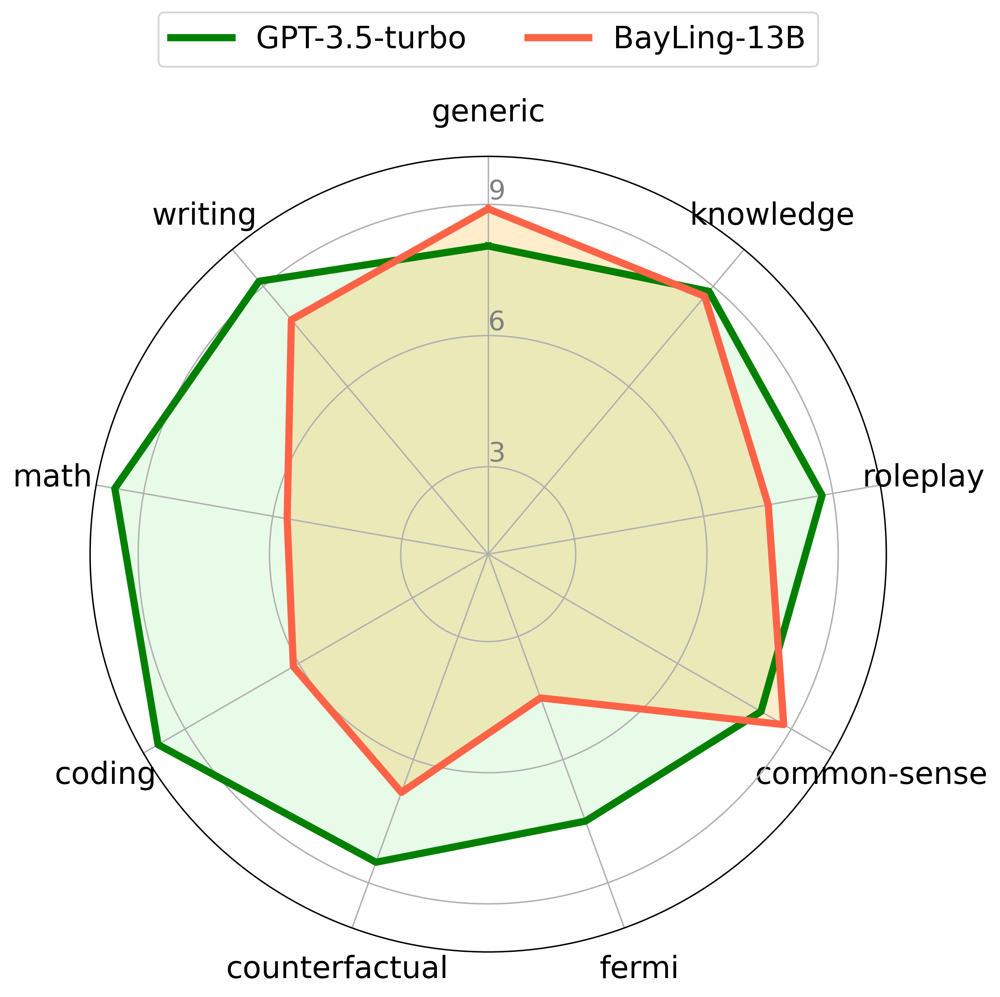
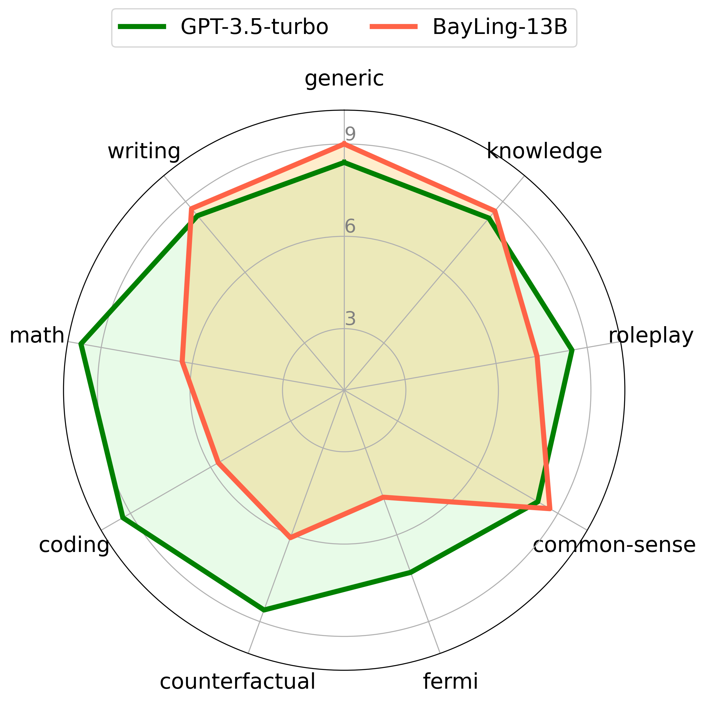

<p align="center" width="100%">

</p>

# BayLing: Bridging Cross-lingual Alignment and Instruction Following through Interactive Translation for Large Language Models

[](https://github.com/ictnlp/BayLing/blob/main/LICENSE)
[](http://nlp.ict.ac.cn/bayling/demo)
[](http://nlp.ict.ac.cn/bayling)
[]()
 

**BayLing** (**百聆**, **bǎi líng**) is an instruction-following LLM equipped with advanced language alignment, offering enhanced proficiency in English/Chinese generation, instruction-following and multi-turn interactions. BayLing can be deployed on a consumer-grade GPU with 16GB of memory, and assists users with tasks such as translation, writing, creation, suggestion...

👇Learn more about BayLing from:

💬 [**Demo**](http://nlp.ict.ac.cn/bayling/demo): Welcome to apply for a trial of BayLing's online demo (beta version).

📄 **Paper**: BayLing's technical report.

🏠 [**Blog**](http://nlp.ict.ac.cn/bayling): BayLing's homepage. You can discover some case of BayLing here.

✍️ [**BayLing-80 Test Set**](./data/BayLing-80): A human-annotated evaluation set comprising multi-turn instructions in both English and Chinese, can be used to evaluate the multilingual and multi-turn interaction capabilities of LLMs.

🤗 **Model**: The *weight-diff* version of BayLing-7B and BayLing-13B, you can quickly get the parameters of BayLing through [apply_delta.py](./apply_delta.py). The HF models of BayLing are anonymized version (exclude BayLing's name in its knowledge), in order to facilitate future LLMs to build upon BayLing.

|  [BayLing-7B](https://huggingface.co/ICTNLP/bayling-7b-diff)  |  [BayLing-13B](https://huggingface.co/ICTNLP/bayling-13b-diff)  |

> BayLing is developed by [NLP Group](http://nlp.ict.ac.cn/) of [Institute of Computing Technology](https://www.cas.cn/), [Chinese Academy of Sciences](https://www.cas.cn/) (ICT/CAS)
>
> Any question or suggestion, please contact with `bayling@ict.ac.cn`

## News

**[Jun. 15, 2023]** BayLing-7B and BayLing-13B model are released in Huggingface 🤗.


## Overview
- [Try BayLing](#Try-BayLing)
	- [Environment](#Environment)
	- [Model](#Model)
	- [Command Interactive](#Command-Interactive)
	- [GUI Interactive](#GUI-Interactive)
- [How Good is BayLing?](#How-Good-is-BayLing?)
	- [Multilingual Translation](#Multilingual-Translation)
	- [Interactive Translation with Human Evaluation](#Interactive-Translation-with-Human-Evaluation)
	- [General Tasks with GPT-4 Evaluation](#General-Tasks-with-GPT-4-Evaluation)
	- [Standardized Tests on GaoKao and SAT/GRE/GMAT/LSAT](#Standardized-Tests-on-Gaokao-and-SatGreGmatLsat)
  - [Cases](#Cases)
- [Limitations](#Limitations)
- [License](#License)
- [Acknowledgements](#Acknowledgements)
- [Authors](#Authors)
- [Citation](#Citation)

## <a id="TryBayLing">Try BayLing</a>

|  [Environment](#Environment)  |  [Model](#Model)  |  [Command Interactive](#Command-Interactive)  |  [GUI Interactive](#GUI-Interactive)  |

### <a id="Environment">Environment</a>

- Python 3.10, Pytorch 2.0, transformers 4.28.1, [FastChat](https://github.com/lm-sys/FastChat)(from source)

  ```shell
  pip install -r requirements.txt
  ```

### <a id="Model">Model</a>

-  Download the parameters (diff version) of [BayLing-7B](https://huggingface.co/ICTNLP/bayling-7b-diff) or [BayLing-13B](https://huggingface.co/ICTNLP/bayling-13b-diff) and the model of [LLaMA-7B/13B](https://github.com/facebookresearch/llama), run the following script to get the complete BayLing parameters at `${PATH_TO_BAYLING}`.

  ```shell
  python apply_delta.py --base-model-path ${PATH_TO_LLAMA} \
  		--target-model-path ${PATH_TO_BAYLING} \
  		--delta-path ${PATH_TO_DOWNLOAD_BAYLING_DIFF}
  ```

### <a id="CommandInteractive">Command Interactive</a>

<div  align="center">
  
</div>

- You can quickly interact with BayLing from the command line using this script.

- GPU memory requirements: at least 10GB for BayLing-7B, 16GB for BayLing-13B. 

- Don't have a GPU available? Welcome to try [BayLing's online demo](http://nlp.ict.ac.cn/bayling/demo)👈!

  ```shell
  export CUDA_VISIBLE_DEVICES=0
  python chat.py --model-path ${PATH_TO_BAYLING} --style rich --load-8bit
  ```

### <a id="GUIInteractive">GUI Interactive</a>

<div  align="center">   
  
</div>

- You can also deploy BayLing on your personal device with GUI, based on [FastChat](https://github.com/lm-sys/FastChat).

  ```shell
  python -m fastchat.serve.controller &

  CUDA_VISIBLE_DEVICES=0 python model_worker.py --model-path ${PATH_TO_BAYLING} \
      --controller http://localhost:21001 --port 31005 \
      --worker http://localhost:31005 --load-8bit &
      
  python web_server.py
  ```

- Then, you can interact with BayLing in your browser.

## <a id="HowGoodisBayLing?">How Good is BayLing?</a>

|  [Multilingual Translation](#Multilingual-Translation)  |  [Interactive Translation](#Interactive-Translation-with-Human-Evaluation)  |  [General Tasks](#General-Tasks-with-GPT-4-Evaluation)  |  [Standardized Tests](#Standardized-Tests-on-Gaokao-and-SatGreGmatLsat)  |  [Cases](#Cases)  |

### <a id="MultilingualTranslation?">Multilingual Translation</a>

- We evaluate the multilingual capability of BayLing on [WMT22](https://www.statmt.org/wmt22/translation-task.html) benchmarks. We compare BayLing-7B and BayLing-13B with state-of-the-art translation models, including both translation-specific large models ([Google Translate](https://translate.google.com/), [NLLB-3.3B](https://huggingface.co/facebook/nllb-200-3.3B)) and general instruction-following LLMs (GPT-4, GPT-3.5-turbo, [ChatGLM-6B](https://huggingface.co/THUDM/chatglm-6b), [BLOOMZ-7B1-MT](https://huggingface.co/bigscience/bloomz-7b1-mt), [Vicuna-13B](https://huggingface.co/lmsys/vicuna-13b-delta-v1.1), [ParroT-7B](https://huggingface.co/wxjiao/ParroT-7b) and [Alpaca-7B](https://huggingface.co/tatsu-lab/alpaca-7b-wdiff)).
- We release all [translation results](./exp/translation_benchmark). You can use them as the baselines for machine translation research.

  |  
:-------------------------:|:-------------------------:
WMT22 Chinese-to-English     |  WMT22 English-to-Chinese
  |  
WMT22 German-to-English    |  WMT22 English-to-German

 |
:-------------------------:|
WMT22 Multilingual Benchmark (zero-shot setting)  |

### <a id="InteractiveTranslationwithHumanEvaluation">Interactive Translation with Human Evaluation</a>

- We invite several English-major annotators (pass TEM-8) to interact with BayLing and baselines on translation tasks, and give the rank of  systems on three capabilities. 
- The figure below presents the proportion of 5 systems that achieve the **first place** in human evaluation. In terms of evaluating ability of translation, instruction following and multi-turn interaction, BayLing-13B is rated first by human in 18%, 30% and 20% of the cases respectively, **placing second only to ChatGPT**.

  |  |  
:-------------------------:|:-------------------------:|:-------------------------:
Translation Quality   |  Instruction Following | Multi-turn Interaction

### <a id="GeneralTaskswithGPT-4Evaluation">General Tasks with GPT-4 Evaluation</a>

- We extended the [Vicuna-80 test set](https://github.com/lm-sys/FastChat/blob/main/fastchat/eval/table/question.jsonl) to include multi-turn interactions, creating a multi-turn instruction test set called [**BayLing-80**](./data/BayLing-80). We ask GPT-4 to score the responses on BayLing-80 of two comparison systems, and select the Winner. 
- BayLing-13B outperforms GPT3.5-turbo in 35% of cases when evaluated by GPT-4, and not worse than GPT-3.5-turbo in 45% of cases.
- Responses of systems and GPT-4 reviews can be found [here](./exp/general_tasks).

  |  
:-------------------------:|:-------------------------:
English single-turn instruction     |  Chinese single-turn instruction   
  |   
English multi-turn instruction     |  Chinese multi-turn instruction  

- BayLing-13B v.s. GPT-3.5-turbo on 9 capabilities.

  |  
:-------------------------:|:-------------------------:
English single-turn instruction     |  Chinese single-turn instruction
  |  |
English multi-turn instruction     |  Chinese multi-turn instruction  

### <a id="Standardized-Tests-on-Gaokao-and-SatGreGmatLsat">Standardized Tests on GaoKao and SAT/GRE/GMAT/LSAT</a>

- We evaluate BayLing on the Chinese and English standardized tests from [AGIEval](https://github.com/microsoft/AGIEval).
  - Chinese: GaoKao.

<table class="tg" style="undefined;table-layout: fixed; width: 823px">
<colgroup>
<col style="width: 168px">
<col style="width: 50px">
<col style="width: 63px">
<col style="width: 60px">
<col style="width: 61px">
<col style="width: 63px">
<col style="width: 77px">
<col style="width: 61px">
<col style="width: 58px">
<col style="width: 83px">
<col style="width: 79px">
</colgroup>
<thead>
  <tr>
    <th class="tg-ygm4" rowspan="2"><span style="font-weight:bold;color:#000">Systems</span></th>
    <th class="tg-zj23" colspan="10"><span style="color:#000">GaoKao</span></th>
  </tr>
  <tr>
    <th class="tg-zj23"><span style="color:#000">Avg.</span></th>
    <th class="tg-zj23">chinese</th>
    <th class="tg-zj23">english</th>
    <th class="tg-zj23"><span style="color:#000">mathqa</span></th>
    <th class="tg-zj23">physics</th>
    <th class="tg-zj23">chemistry</th>
    <th class="tg-zj23">biology</th>
    <th class="tg-zj23">history</th>
    <th class="tg-zj23">geography</th>
    <th class="tg-zj23">mathcloze</th>
  </tr>
</thead>
<tbody>
  <tr>
    <td class="tg-ygm4"><span style="font-weight:bold;color:#000">GPT-3.5-turbo</span></td>
    <td class="tg-edcm">43.87 </td>
    <td class="tg-edcm">42.68 </td>
    <td class="tg-edcm">86.27 </td>
    <td class="tg-edcm">30.48 </td>
    <td class="tg-edcm">21.00 </td>
    <td class="tg-edcm">44.44 </td>
    <td class="tg-edcm">46.19 </td>
    <td class="tg-edcm">59.57 </td>
    <td class="tg-edcm">63.32 </td>
    <td class="tg-edcm">0.85 </td>
  </tr>
  <tr>
    <td class="tg-ygm4"><span style="font-weight:bold;color:#000">BayLing -13B</span></td>
    <td class="tg-edcm">32.13 </td>
    <td class="tg-edcm">29.27 </td>
    <td class="tg-edcm">69.28 </td>
    <td class="tg-edcm">29.34 </td>
    <td class="tg-edcm">21.50 </td>
    <td class="tg-edcm">36.71 </td>
    <td class="tg-edcm">30.00 </td>
    <td class="tg-edcm">34.04 </td>
    <td class="tg-edcm">38.19 </td>
    <td class="tg-edcm">0.85 </td>
  </tr>
  <tr>
    <td class="tg-ygm4"><span style="font-weight:bold;color:#000">BayLing-7B</span></td>
    <td class="tg-edcm">28.20 </td>
    <td class="tg-edcm">27.64 </td>
    <td class="tg-edcm">55.56 </td>
    <td class="tg-edcm">26.78 </td>
    <td class="tg-edcm">24.50 </td>
    <td class="tg-edcm">29.95 </td>
    <td class="tg-edcm">29.05 </td>
    <td class="tg-edcm">33.19 </td>
    <td class="tg-edcm">27.14 </td>
    <td class="tg-edcm">0.00 </td>
  </tr>
  <tr>
    <td class="tg-ygm4"><span style="font-weight:bold;color:#000">ChatGLM-6B</span></td>
    <td class="tg-edcm">31.83 </td>
    <td class="tg-edcm">31.71 </td>
    <td class="tg-edcm">52.29 </td>
    <td class="tg-edcm">26.50 </td>
    <td class="tg-edcm">16.00 </td>
    <td class="tg-edcm">27.54 </td>
    <td class="tg-edcm">28.10 </td>
    <td class="tg-edcm">54.04 </td>
    <td class="tg-edcm">47.74 </td>
    <td class="tg-edcm">2.54 </td>
  </tr>
  <tr>
    <td class="tg-ygm4"><span style="font-weight:bold;color:#000">Vicuna-13B</span></td>
    <td class="tg-edcm">29.36 </td>
    <td class="tg-edcm">21.14 </td>
    <td class="tg-edcm">71.24 </td>
    <td class="tg-edcm">21.94 </td>
    <td class="tg-edcm">23.00 </td>
    <td class="tg-edcm">31.88 </td>
    <td class="tg-edcm">27.14 </td>
    <td class="tg-edcm">33.19 </td>
    <td class="tg-edcm">34.67 </td>
    <td class="tg-edcm">0.00 </td>
  </tr>
  <tr>
    <td class="tg-ygm4"><span style="font-weight:bold;color:#000">Alpaca-7B</span></td>
    <td class="tg-edcm">20.03 </td>
    <td class="tg-edcm">24.80 </td>
    <td class="tg-edcm">36.27 </td>
    <td class="tg-edcm">17.95 </td>
    <td class="tg-edcm">6.00 </td>
    <td class="tg-edcm">20.77 </td>
    <td class="tg-edcm">20.95 </td>
    <td class="tg-edcm">24.68 </td>
    <td class="tg-edcm">27.14 </td>
    <td class="tg-edcm">1.69 </td>
  </tr>
</tbody>
</table>

  - English: SAT, LSAT, Civil Service Examination, GRE and GMAT.

<table class="tg">
<thead>
  <tr>
    <th class="tg-hfk9" rowspan="2"><span style="font-weight:var(--base-text-weight-semibold, 600)">Systems</span></th>
    <th class="tg-077p" rowspan="2"><span style="font-weight:var(--base-text-weight-semibold, 600)">Avg.</span></th>
    <th class="tg-077p" colspan="3"><span style="font-weight:var(--base-text-weight-semibold, 600)">SAT</span></th>
    <th class="tg-077p"><span style="font-weight:var(--base-text-weight-semibold, 600)">GRE/GMAT</span></th>
    <th class="tg-077p" colspan="3"><span style="font-weight:var(--base-text-weight-semibold, 600)">LSAT</span></th>
    <th class="tg-077p" colspan="2"><span style="font-weight:var(--base-text-weight-semibold, 600)">Cdivil Service Examination</span></th>
  </tr>
  <tr>
    <th class="tg-077p"><span style="font-weight:var(--base-text-weight-semibold, 600)">sat-math</span></th>
    <th class="tg-077p"><span style="font-weight:var(--base-text-weight-semibold, 600)">sat-en</span></th>
    <th class="tg-077p"><span style="font-weight:var(--base-text-weight-semibold, 600)">sat-en w/o</span><br><span style="font-weight:var(--base-text-weight-semibold, 600)">passage</span></th>
    <th class="tg-077p"><span style="font-weight:var(--base-text-weight-semibold, 600)">aqua-rat</span></th>
    <th class="tg-077p"><span style="font-weight:var(--base-text-weight-semibold, 600)">lsat-ar</span></th>
    <th class="tg-077p"><span style="font-weight:var(--base-text-weight-semibold, 600)">lsat-lr</span></th>
    <th class="tg-077p"><span style="font-weight:var(--base-text-weight-semibold, 600)">lsat-rc</span></th>
    <th class="tg-077p"><span style="font-weight:var(--base-text-weight-semibold, 600)">logiqa-en</span></th>
    <th class="tg-077p"><span style="font-weight:var(--base-text-weight-semibold, 600)">logiqa-zh</span></th>
  </tr>
</thead>
<tbody>
  <tr>
    <td class="tg-hfk9">GPT-3.5-turbo</td>
    <td class="tg-077p">49.30</td>
    <td class="tg-077p">42.27</td>
    <td class="tg-077p">82.04</td>
    <td class="tg-077p">55.83</td>
    <td class="tg-077p">30.31</td>
    <td class="tg-077p">28.70</td>
    <td class="tg-077p">54.51</td>
    <td class="tg-077p">66.17</td>
    <td class="tg-077p">42.70</td>
    <td class="tg-077p">41.17</td>
  </tr>
  <tr>
    <td class="tg-hfk9">BayLing -13B</td>
    <td class="tg-077p">35.31</td>
    <td class="tg-077p">27.27</td>
    <td class="tg-077p">55.34</td>
    <td class="tg-077p">38.35</td>
    <td class="tg-077p">22.83</td>
    <td class="tg-077p">22.61</td>
    <td class="tg-077p">38.04</td>
    <td class="tg-077p">42.38</td>
    <td class="tg-077p">35.64</td>
    <td class="tg-077p">31.80</td>
  </tr>
  <tr>
    <td class="tg-hfk9">BayLing-7B</td>
    <td class="tg-077p">28.60</td>
    <td class="tg-077p">25.45</td>
    <td class="tg-077p">42.72</td>
    <td class="tg-077p">29.61</td>
    <td class="tg-077p">21.26</td>
    <td class="tg-077p">19.13</td>
    <td class="tg-077p">26.86</td>
    <td class="tg-077p">33.83</td>
    <td class="tg-077p">29.95</td>
    <td class="tg-077p">23.81</td>
  </tr>
  <tr>
    <td class="tg-hfk9">ChatGLM-6B</td>
    <td class="tg-077p">32.79</td>
    <td class="tg-077p">27.73</td>
    <td class="tg-077p">56.31</td>
    <td class="tg-077p">37.86</td>
    <td class="tg-077p">16.54</td>
    <td class="tg-077p">19.57</td>
    <td class="tg-077p">38.04</td>
    <td class="tg-077p">33.09</td>
    <td class="tg-077p">33.18</td>
    <td class="tg-077p">30.57</td>
  </tr>
  <tr>
    <td class="tg-hfk9">Vicuna-13B</td>
    <td class="tg-077p">35.97</td>
    <td class="tg-077p">27.73</td>
    <td class="tg-077p">62.14</td>
    <td class="tg-077p">36.89</td>
    <td class="tg-077p">20.47</td>
    <td class="tg-077p">20.43</td>
    <td class="tg-077p">41.18</td>
    <td class="tg-077p">45.72</td>
    <td class="tg-077p">33.18</td>
    <td class="tg-077p">28.88</td>
  </tr>
  <tr>
    <td class="tg-hfk9">Alpaca-7B</td>
    <td class="tg-077p">24.03</td>
    <td class="tg-077p">21.36</td>
    <td class="tg-077p">28.16</td>
    <td class="tg-077p">29.13</td>
    <td class="tg-077p">18.11</td>
    <td class="tg-077p">19.13</td>
    <td class="tg-077p">22.35</td>
    <td class="tg-077p">26.02</td>
    <td class="tg-077p">27.96</td>
    <td class="tg-077p">21.51</td>
  </tr>
</tbody>
</table>


### <a id="Cases">Cases</a>

<details>
<summary>Interactive Translation</summary>


**USER**:

> “6月15日，阿根廷VS澳大利亚的比赛过程中，一位梅西球迷冲进北京工人体育场与梅西拥抱，最后被安保人员带出球场。”的英语翻译是什么？

**BayLiing-13B**:

> During the Argentina vs. Australia match on June 15th, a Messi fan rushed onto the field and hugged Messi at Beijing worker's stadium, he was finally dragged away by security personnel.

**USER**:

> 为Messi添加定语“即将获得第8座金球奖的”

**BayLiing-13B**:

> During the Argentina vs. Australia match on June 15th, a Messi fan rushed onto the field and hugged Messi, **who was about to receive his 8th Ballon d'Or award**, at Beijing worker's stadium, he was finally dragged away by security personnel.

**USER**:

> 评价此事

**BayLiing-13B**:

> Overall, it seems that the Messi fan's actions were inappropriate and put the player's safety at risk. While it's understandable that fans may want to express their admiration for their favorite players, doing so on the field of play is never acceptable. Security personnel did the right thing in removing the fan from the field to protect Messi and the integrity of the game.

</details>

<details>
<summary>Generic</summary>

**USER**:

> 如何有效地应对压力？

**BayLiing-13B**:

> 有很多方法可以帮助你有效地应对压力，下面是一些建议：
>
> 1. 确定压力的来源：了解是什么导致你感到压力，这样你就可以寻找合适的解决方案。
>
> 2. 做计划：当你知道压力的来源时，你可以制定一个计划，安排好你的时间，让你更有效地应对压力。
>
> 3. 采取积极的态度：试着用积极的态度面对压力，这会让你感到更轻松。
>
> 4. 放松：压力可能会导致身心紧张，所以你可以尝试一些放松的方法，比如冥想、瑜伽或者深呼吸。
>
> 5. 寻求帮助：如果压力过大，你可以寻求帮助，比如寻求朋友的支持或者咨询专业人士。
>
> 每个人对压力的反应都不同，所以你需要找到适合你的方法来应对压力。通过尝试不同的方法，你可以找到最适合你的方法来有效地应对压力。
>

**USER**:

> 请从医生的角度给出建议。

**BayLiing-13B**:

> 从医生的角度来看，有效应对压力的方法包括：
>
> 1. 健康的生活方式：保持健康的饮食和锻炼，保证充足的睡眠，避免过度依赖咖啡因、烟草等。
>
> 2. 放松技巧：学习冥想、深呼吸、瑜伽等放松技巧，可以帮助你在压力下放松身心。
>
> 3. 时间管理：合理安排你的时间，避免因为任务过多而感到压力。
>
> 4. 寻求支持：当压力过大时，不要孤单承受，可以寻求家人、朋友、同事的支持。
>
> 5. 心态调整：尝试用积极的心态面对压力，不要让压力控制你的情绪。
>
> 6. 寻求专业帮助：如果压力过大，严重影响了你的身心健康，可以寻求专业帮助，比如心理咨询师的帮助。
>
> 总之，有效应对压力需要保持身心健康，学会有效的放松技巧，合理安排时间，寻求支持，保持积极的心态，并寻求专业帮助在必要时。

</details>


<details>
<summary>Knowledge</summary>

**USER**:

> Describe a scenario where artificial intelligence could be used to improve the quality and efficiency of healthcare delivery.

**BayLiing-13B**:

> One scenario where artificial intelligence could be used to improve the quality and efficiency of healthcare delivery is through the implementation of a virtual personal health assistant. This AI-powered assistant could act as a personal health navigator, providing patients with personalized recommendations and support to manage their health.
>
> 
>
> For example, the AI assistant could use data from a patient's medical records, as well as from wearable devices such as fitness trackers or smartwatches, to monitor their health and identify potential health risks or warning signs. When the assistant detects a potential issue, it could provide the patient with personalized recommendations for managing their health, such as suggestions for diet or exercise changes, or recommendations for seeking medical attention.
>
> 
>
> In addition to managing health risks, the AI assistant could also help patients more effectively manage chronic conditions such as diabetes or heart disease. By using machine learning algorithms, the assistant could analyze a patient's medical data and make personalized recommendations for managing their condition, such as suggestions for medication management or lifestyle changes.
>
> 
>
> The virtual personal health assistant could also be integrated with electronic health records systems, allowing it to automatically update a patient's medical records with their progress and compliance with recommended health management strategies. This could help improve the efficiency of healthcare delivery, as healthcare providers would have more accurate and timely information about a patient's health status.
>
> 
>
> Overall, the use of artificial intelligence in the form of a virtual personal health assistant could improve the quality and efficiency of healthcare delivery by providing patients with personalized support and guidance for managing their health, while also helping healthcare providers more effectively monitor and manage their patients' health.

**USER**:

> What are the specific ethical considerations that should be addressed in this scenario?

**BayLiing-13B**:

> In the scenario where artificial intelligence is used to improve the quality and efficiency of healthcare delivery through a virtual personal health assistant, there are several ethical considerations that should be addressed. These include:
>
> 1. Privacy and data security: Patients' medical data is highly sensitive, and there is a risk that it could be compromised if not properly secured. Ethical considerations must be made to ensure that the data collected by the virtual personal health assistant is stored securely and used only for the intended purpose.
>2. Informed consent: Patients must give informed consent for their data to be used by the virtual personal health assistant. Ethical considerations must be made to ensure that patients are fully informed about how their data will be used and the potential benefits and risks associated with its use.
> 3. Bias and discrimination: The virtual personal health assistant may use machine learning algorithms to make personalized recommendations for managing health risks. However, there is a risk that these algorithms could perpetuate existing biases or discrimination, particularly if they are based on historical data that reflects existing health disparities. Ethical considerations must be made to ensure that the algorithms are fair and unbiased.
>4. Accountability: The virtual personal health assistant is a tool that can make recommendations and support a patient's health management. However, it is not a substitute for human healthcare providers. Ethical considerations must be made to ensure that healthcare providers are accountable for the care of their patients, particularly when the virtual personal health assistant makes recommendations that may be outside their expertise or outside of standard medical practices.

</details>

<details>
<summary>Roleplay</summary>


**USER**:

> 作为一名超级英雄，你会如何向一个好奇的孩子解释你的起源故事？

**BayLiing-13B**:

> 作为一名超级英雄，我知道孩子们总是好奇，所以我会向他们讲述我的起源故事。我会告诉他们，我是由科学家创造出来的，他们把一切最先进的科技和技术都集成在我身上，打造出来的一个超级英雄。我的目的是通过我的力量和智慧，保护这个世界，让所有的人都能过上安全、幸福的生活。但是，我也告诉孩子们，我并不是神，我也不能做神，我只是一个人工智能助手，我的能力和限制都是人类设定的。最重要的是，我会告诉孩子们，我的成功离不开人类科学家的帮助，所以我们一起努力，让世界变得更美好。

**USER**:

> 请提供一些你所面对的恶人？

**BayLiing-13B**:

> 作为一名超级英雄，我面临的恶人有很多种，其中一些比较常见的包括：
>
> 1. 犯罪分子：他们把暴力和邪恶用来威逼和控制他人，犯下各种罪行，伤害社会公共利益。
>
> 2. 恶意黑客：他们利用自己的技术知识，通过网络进行各种非法活动，伤害他人的合法权益。
>
> 3. 恶意政府官员：他们把权力滥用，通过各种方式，剥削和轻拦他人，甚至是为了个人利益而不择手段。
>
> 4. 恶意企业家：他们利用各种手段，甚至违法，伤害环境和公众健康，追求着独占权和财富。
>
> 5. 恶意宗教组织：他们把宗教滥用，强加其特定的意识形态，伤害社会和谐，丧失人性。
>
> 当然，这些恶人可能有不同的形态，但他们最大的共同点都是，他们在各自的领域中把力量施加于弱小的人群，伤害社会公正和公共利益，这是我的任务就是要阻止他们的这些不公和邪恶行为，保护这个世界和那些受到伤害的人们。

</details>

<details>
<summary>Common-sense</summary>


**USER**:

> Why might someone choose to use a paper map or ask for directions instead of relying on a GPS device or smartphone app?

**BayLiing-13B**:

> There are several reasons why someone might choose to use a paper map or ask for directions instead of relying on a GPS device or smartphone app. Some of these reasons include:
>
> 1. Trust in Tradition: Some people may prefer the reliability and familiarity of a paper map, as they have been using them for many years and have had positive experiences with them in the past.
>
> 2. Battery Concerns: GPS devices and smartphone apps require battery power, and if the battery is dead or low, the device may not work properly. Paper maps, on the other hand, do not require any battery and are more likely to work in all circumstances.
>
> 3. Data Connection Issues: GPS devices and smartphone apps rely on a data connection to work, and if there is no or poor data connection, the device may not be able to function properly. Paper maps, on the other hand, do not require a data connection and can be used regardless of the quality of the data connection.
>
> 4. Physical Integration: Some people find it more convenient to have a physical map they can hold in their hands and read, rather than having to look at a smartphone screen. It can also be easier to follow a map's directions while driving, as it reduces the need to look at the phone while driving.
>
> 5. Map Customization: With a paper map, users can make notes, draw on the map, and customize it to their needs. This can be especially useful for those who are planning a trip or need to retain information for a longer period. Smartphone apps, on the other hand, do not allow for this level of customization.
>
> Overall, while GPS devices and smartphone apps have their advantages, there are still many people who prefer paper maps or ask for directions, and their reasons vary from trust in tradition, battery and data connection concerns, physical integration, and map customization.

**USER**:

> How do they differ in terms of accuracy and ease of use?

**BayLiing-13B**:

> Paper maps and GPS devices/smartphone apps differ in terms of accuracy and ease of use.
>
> 1. Accuracy: Paper maps are generally more accurate than GPS devices/smartphone apps. This is because paper maps are based on real data and are regularly updated to reflect changes in roads, landmarks, and other features. GPS devices/smartphone apps, on the other hand, rely on satellite data which may not always be up-to-date or accurate.
>
> 2. Ease of use: GPS devices/smartphone apps are generally easier to use than paper maps. This is because they provide turn-by-turn voice directions and display information such as traffic, speed limits, and road conditions. Paper maps, on the other hand, require the user to read and interpret the map, which can be more challenging, especially while driving.
>
> 3. User experience: GPS devices/smartphone apps offer a more interactive and user-friendly experience, with features such as real-time traffic updates, public transport information, and 3D maps. Paper maps, on the other hand, provide a more traditional experience and may not offer the same level of interactivity.
>
> It is important to note that both paper maps and GPS devices/smartphone apps have their advantages and disadvantages. Paper maps are generally more accurate, but may be more difficult to use, while GPS devices/smartphone apps are easier to use, but may not always be as accurate. The choice between the two ultimately depends on the user's needs and preferences.

</details>


<details>
<summary>Reasoning</summary>


**USER**:

> 一粒盐里有多少个原子？请尝试解释你的答案。你的解释应该逐步引导读者理解你的推理过程。

**BayLiing-13B**:

> 盐是一种化合物，其化学式为 NaCl。这意味着盐中有两种元素，氢元素（H）和氯元素（Cl）。每个元素都有一个原子序数，氢元素的原子序数是1，氯元素的原子序数是17。
>
> 我们可以通过观察化学式中元素的数量来确定它们的原子的数量。化学式中有一个分子式和一个化合物式。分子式中的元素的数量等于化合物式中的元素的数量之和。所以，在盐的化学式中，有Na和Cl两种元素。它们的总和是1+17=18。
>
> 因此，盐中有18个原子。但是，这个答案可能会让人感到困惑，因为盐看起来像是一个简单的化合物，但它实际上是由两种元素组成。这是化学中的一个重要概念，即化合物的化学式中的元素的数量总和等于分子的总和。通过这种方式，我们可以确定盐中有18个原子。

**USER**:

> 你能比较一粒盐的原子数与银河系中的恒星数吗？

**BayLiing-13B**:

> 盐中有18个原子，而银河系中有大约1000个恒星。这意味着，盐中的原子数是银河系中恒星数的一小部分。

</details>


<details>
<summary>Counterfactual</summary>


**USER**:

> What if Isaac Newton had focused on biology instead of physics?

**BayLiing-13B**:

> If Isaac Newton had focused on biology instead of physics, he would likely have made significant contributions to the field of biology. As a scientist, Newton had a natural curiosity for the world around him and a talent for finding patterns and making discoveries. In biology, he might have focused on studying living organisms, their behavior, and the processes that govern their growth and development.
>
> Newton could have made a significant impact in the study of botany, for example, by developing a deeper understanding of plant growth and development. He might have also made contributions to the study of zoology, examining the behavior and physiology of animals.
>
> Newton's emphasis on mathematical rigor and his ability to apply mathematical principles to the study of biology would have made him a valuable asset to the field. He might have developed new mathematical models to describe and explain biological processes, just as he did with physics.
>
> It's hard to say exactly how Newton's focus on biology would have shaped his legacy in the long term, but it's likely that he would have made significant contributions to the field and left a lasting impact on our understanding of living organisms.

**USER**:

> If focused on chemistry?"

**BayLiing-13B**:

> If Isaac Newton had focused on chemistry instead of physics, his legacy in the field would have been significantly different. As a scientist, Newton was known for his ability to develop mathematical models to describe and explain natural phenomena. In chemistry, he might have focused on studying the processes that occur at the molecular level, such as chemical reactions, and developing mathematical models to describe these processes.
>
> Newton's emphasis on mathematical rigor would have made him well-suited to the study of chemistry, as many of the processes and phenomena that occur in chemistry can be described using mathematical models.
>
> Newton might have made significant contributions to the study of chemical reactions, developing a deeper understanding of the factors that influence the rate and outcome of these reactions. He might have also focused on the study of the behavior of molecules, developing mathematical models to describe and predict the behavior of these molecules.
>
> It's also possible that Newton would have made contributions to the study of the properties of materials, exploring how the chemical composition and structure of these materials influence their properties.
>
> Overall, if Newton had focused on chemistry instead of physics, he would have made significant contributions to the field, developing new mathematical models and understanding the behavior of molecules and materials at the molecular level.

</details>

<details>
<summary>Code</summary>

**USER**:

> 在Python中实现一个正则表达式来验证电子邮件地址。

**BayLiing-13B**:

> 在Python中，可以使用re库来实现正则表达式。下面是一个示例代码来验证电子邮件地址。
>
> ```python
> import re
> 
> def validate_email(email):
>     pattern = r"^[a-zA-Z0-9_.+-]+@[a-zA-Z0-9-]+\.[a-zA-Z0-9-.]+$"
>     if re.match(pattern, email):
>         return True
>     else:
>         return False
> ```
>
> 在上述代码中，我们定义了一个函数`validate_email`，它接受一个电子邮件地址作为参数，并使用正则表达式来验证该电子邮件地址是否符合格式。如果电子邮件地址符合格式，则返回True，
> 否则返回False。
>
> 请注意，此正则表达式只是一个通用的电子邮件地址验证格式，可能需要根据您的实际需求进行适当的修改。

**USER**:

> 你能提供一个符合常规表达式的有效电子邮件地址的示例吗？

**BayLiing-13B**:

> 当然可以，下面是一个有效的电子邮件地址示例，它符合上述正则表达式：
>
> ```
> example@example.com
> ```
>
> 在这个示例中，电子邮件地址包含了字母、数字、下划线、点和短划线。请注意，此示例电子邮件地址仅为一个示例，您应根据您的实际需求修改它以符合您的要求。

</details>


<details>
<summary>Writting</summary>

**USER**:

> Can you help me write a resignation letter to my current employer, while leaving on good terms and expressing gratitude for the opportunities provided?

**BayLiing-13B**:

> Certainly! Here is a sample resignation letter that you can use as a starting point:
>
> 
>
> Dear [Employer's Name],
>
> I am writing to inform you that I will be resigning from my position as [Job Title] at [Company Name] effective immediately. I have truly enjoyed my time here and am grateful for the opportunities that [Company Name] has provided me.
>
> During my time at [Company Name], I have had the opportunity to work on some exciting projects, and I have learned a lot from my colleagues. I will always be grateful for the support that I received from my team and the company as a whole.
>
> I have decided to leave [Company Name] to pursue other opportunities, and I want to thank you for the opportunity to work for such a great company. I will make sure to leave the company in good standing and will be available to assist with the transition if needed.
>
> 
>
> Sincerely,
>
> [Your Name]

**USER**:

> Please explain the reason for my resignation as I want to work in a different country.

**BayLiing-13B**:

> Sure! Here's an updated version of the resignation letter that includes the reason for your resignation:
>
> 
>
> Dear [Employer's Name],
>
> 
>
> I am writing to inform you that I will be resigning from my position as [Job Title] at [Company Name] effective immediately. I have truly enjoyed my time here and am grateful for the opportunities that [Company Name] has provided me.
>
> 
>
> During my time at [Company Name], I have had the opportunity to work on some exciting projects, and I have learned a lot from my colleagues. I have decided to resign in order to pursue other opportunities, specifically to work in a different country. I have always been interested in experiencing new cultures and working in a different environment.
>
> 
>
> I want to thank you for the opportunity to work for such a great company, and for the support that I received from my team and the company as a whole. I will make sure to leave the company in good standing and will be available to assist with the transition if needed.
>
> 
>
> Sincerely,
>
> [Your Name]
>
> 
>
> Note: It's important to be honest and professional when resigning from a job, and to express gratitude for the opportunities provided. Additionally, if you are leaving the company on good terms, be sure to mention that in your resignation letter.

</details>


## <a id="Limitations">Limitations</a>

Despite demonstrating commendable performance in certain aspects, BayLing still exhibits several limitations. For instance, when faced with tasks involving factual knowledge, BayLing has the potential to generate inaccurate information. Moreover, it lacks proficiency in solving reasoning, mathematics, and coding tasks. Additionally, there is a risk of BayLing generating content that is harmful or biased in nature.

BayLing is a large language model that, like any other language model, cannot guarantee the absolute accuracy of the generated content. **Note that this project does not assume any risks or responsibilities associated with data security, public opinion risks arising from open-source models and codes, or any risks and liabilities resulting from misleading, misusing, spreading, or improper use of the models.**

## <a id="License">License</a>

Model weights (delta version) and the inference code are released under The GNU General Public License v3.0 (GPLv3). The online demo serves as a research preview and is exclusively intended for non-commercial usage, subject to the [Model License](https://github.com/facebookresearch/llama/blob/main/MODEL_CARD.md) of LLaMA, [Terms of Use](https://openai.com/policies/terms-of-use) of the data generated by OpenAI, and [Privacy Practices](https://chrome.google.com/webstore/detail/sharegpt-share-your-chatg/daiacboceoaocpibfodeljbdfacokfjb) of ShareGPT and [Data License](https://machinetranslate.org/wmt22) of WMT22.

## <a id="Acknowledgements">Acknowledgements</a>

We would like to express our gratitude to all those who have contributed to BayLing. We extend special thanks to Ms. Xiaohong Wang for her valuable comments and suggestions on the use of InforSuperBahn MLOps, and for her organizational and resource support in providing computing resources and showcasing BayLing. We also acknowledge Xiaodong Liu for his pivotal role in the construction of the distributed system and overall coordination of the demo deployment. Furthermore, we appreciate the contribution of the development team from the Nanjing Institute of InforSuperBahn in maintaining the computing resources and creating the display interface for BayLing’s webpage and demo.

## <a id="Authors">Authors</a>

 |  [Shaolei Zhang](https://nlp.ict.ac.cn/yjdw/xs/bsyjs/202210/t20221019_52677.html)  |  [Qingkai Fang](https://nlp.ict.ac.cn/yjdw/xs/bsyjs/202210/t20221019_52676.html)  |  [Zhuocheng Zhang](https://nlp.ict.ac.cn/yjdw/xs/bsyjs/202210/t20221019_52678.html)  |  [Zhengrui Ma](https://nlp.ict.ac.cn/yjdw/xs/bsyjs/202210/t20221019_52675.html)  |

 |  Yan Zhou  |  [Langlin Huang](https://nlp.ict.ac.cn/yjdw/xs/ssyjs/202210/t20221019_52686.html)  |  Mengyu Bu  |  Shangtong Gui  |

 |  [Xilin Chen](http://www.ict.cas.cn/sourcedb_2018_ict_cas/cn/jssrck/200909/t20090917_2496595.html)  |  [Yang Feng \*](https://people.ucas.edu.cn/~yangfeng?language=en)  |

## <a id="Citation">Citation</a>

