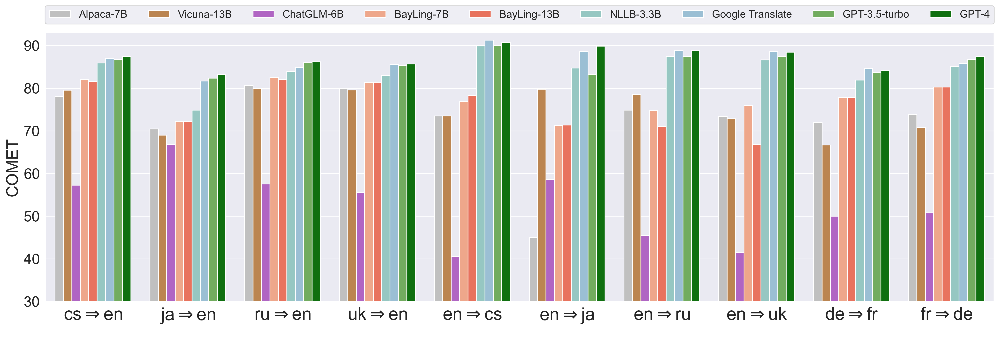
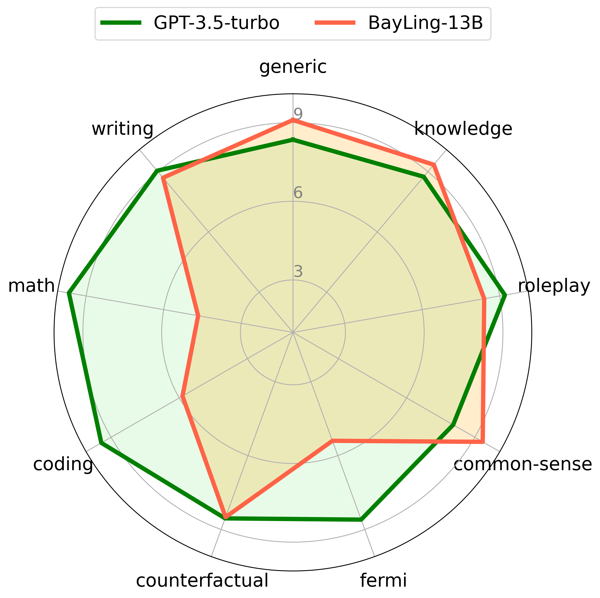

<p align="center" width="100%">

</p>

# BayLing: Bridging Cross-lingual Alignment and Instruction Following through Interactive Translation for Large Language Models

[](https://github.com/ictnlp/BayLing/blob/main/LICENSE)
[](http://nlp.ict.ac.cn/bayling/demo)
[](http://nlp.ict.ac.cn/bayling)
[]()
 

**BayLing** (**百聆**, **bǎi líng**) is an instruction-following LLM equipped with advanced language alignment, offering enhanced proficiency in English/Chinese generation, instruction-following and multi-turn interactions. BayLing can be deployed on a consumer-grade GPU with 16GB of memory, and assists users with tasks such as translation, writing, creation, suggestion...

👇Learn more about BayLing from:

💬 [**Demo**](http://nlp.ict.ac.cn/bayling/demo): Welcome to apply for a trial of BayLing's online demo (beta version).

📄 **Paper**: BayLing's technical report.

🏠 [**Blog**](http://nlp.ict.ac.cn/bayling): BayLing's homepage. You can discover some case of BayLing here.

✍️ [**BayLing-80 Test Set**](./data/BayLing-80): A human-annotated evaluation set comprising multi-turn instructions in both English and Chinese, can be used to evaluate the multilingual and multi-turn interaction capabilities of LLMs.

🤗 **Model**: The *weight-diff* version of BayLing-7B and BayLing-13B, you can quickly get the parameters of BayLing through [apply_delta.py](./apply_delta.py). The HF models of BayLing are anonymized version (exclude BayLing's name in its knowledge), in order to facilitate future LLMs to build upon BayLing.

- [BayLing-7B](https://huggingface.co/ICTNLP/bayling-7b-diff)
- [BayLing-13B](https://huggingface.co/ICTNLP/bayling-13b-diff)

> BayLing is developed by [NLP Group](http://nlp.ict.ac.cn/) of [Institute of Computing Technology](https://www.cas.cn/), [Chinese Academy of Sciences](https://www.cas.cn/) (ICT/CAS)
>
> Any question or suggestion, please contact with `bayling@ict.ac.cn`

## News

**[Jun. 15, 2023]** BayLing-7B and BayLing-13B model are released in Huggingface 🤗.


## Overview
- [Try BayLing](#Try-BayLing)
	- [Environment](#Environment)
	- [Model](#Model)
	- [Command Interactive](#Command-Interactive)
	- [GUI Interactive](#GUI-Interactive)
- [How Good is BayLing?](#How-Good-is-BayLing?)
	- [Multilingual Translation](#Multilingual-Translation)
	- [Interactive Translation with Human Evaluation](#Interactive-Translation-with-Human-Evaluation)
	- [General Tasks with GPT-4 Evaluation](#General-Tasks-with-GPT-4-Evaluation)
	- [Standardized Tests on GaoKao and SAT/GRE/GMAT/LSAT](#Standardized-Tests-on-Gaokao-and-SatGreGmatLsat)
- [Limitations](#Limitations)
- [License](#License)
- [Acknowledgements](#Acknowledgements)
- [Authors](#Authors)
- [Citation](#Citation)

## <a id="TryBayLing">Try BayLing</a>

|  [Environment](#Environment)  |  [Model](#Model)  |  [Command Interactive](#Command-Interactive)  |  [GUI Interactive](#GUI-Interactive)  |

### <a id="Environment">Environment</a>

- Python 3.10, Pytorch 2.0, transformers 4.28.1, [FastChat](https://github.com/lm-sys/FastChat)(from source)

  ```shell
  pip install -r requirements.txt
  ```

### <a id="Model">Model</a>

-  Download the parameters (diff version) of [BayLing-7B](https://huggingface.co/ICTNLP/bayling-7b-diff) or [BayLing-13B](https://huggingface.co/ICTNLP/bayling-13b-diff) and the model of [LLaMA-7B/13B](https://github.com/facebookresearch/llama), run the following script to get the complete BayLing parameters at `${PATH_TO_BAYLING}`.

  ```shell
  python apply_delta.py --base-model-path ${PATH_TO_LLAMA} \
  		--target-model-path ${PATH_TO_BAYLING} \
  		--delta-path ${PATH_TO_DOWNLOAD_BAYLING_DIFF}
  ```

### <a id="CommandInteractive">Command Interactive</a>

<div  align="center">
  
</div>

- You can quickly interact with BayLing from the command line using this script.

- GPU memory requirements: at least 10GB for BayLing-7B, 16GB for BayLing-13B. 

- Don't have a GPU available? Welcome to try [BayLing's online demo](http://nlp.ict.ac.cn/bayling/demo)👈!

  ```shell
  export CUDA_VISIBLE_DEVICES=0
  python chat.py --model-path ${PATH_TO_BAYLING} --style rich --load-8bit
  ```

### <a id="GUIInteractive">GUI Interactive</a>

<div  align="center">   
  
</div>

- You can also deploy BayLing on your personal device with GUI, based on [FastChat](https://github.com/lm-sys/FastChat).

  ```shell
  python -m fastchat.serve.controller &

  CUDA_VISIBLE_DEVICES=0 python model_worker.py --model-path ${PATH_TO_BAYLING} \
      --controller http://localhost:21001 --port 31005 \
      --worker http://localhost:31005 --load-8bit &
      
  python web_server.py
  ```

- Then, you can interact with BayLing in your browser.

## <a id="HowGoodisBayLing?">How Good is BayLing?</a>

|  [Multilingual Translation](#Multilingual-Translation)  |  [Interactive Translation](#Interactive-Translation-with-Human-Evaluation)  |  [General Tasks](#General-Tasks-with-GPT-4-Evaluation)  |  [Standardized Tests](#Standardized-Tests-on-Gaokao-and-SatGreGmatLsat)  |

### <a id="MultilingualTranslation?">Multilingual Translation</a>

- We evaluate the multilingual capability of BayLing on [WMT22](https://www.statmt.org/wmt22/translation-task.html) benchmarks. We compare BayLing-7B and BayLing-13B with state-of-the-art translation models, including both translation-specific large models ([Google Translate](https://translate.google.com/), [NLLB-3.3B](https://huggingface.co/facebook/nllb-200-3.3B)) and general instruction-following LLMs (GPT-4, GPT-3.5-turbo, [ChatGLM-6B](https://huggingface.co/THUDM/chatglm-6b), [BLOOMZ-7B1-MT](https://huggingface.co/bigscience/bloomz-7b1-mt), [Vicuna-13B](https://huggingface.co/lmsys/vicuna-13b-delta-v1.1), [ParroT-7B](https://huggingface.co/wxjiao/ParroT-7b) and [Alpaca-7B](https://huggingface.co/tatsu-lab/alpaca-7b-wdiff)).
- We release all [translation results](./exp/translation_benchmark). You can use them as the baselines for machine translation research.

  |  
:-------------------------:|:-------------------------:
WMT22 Chinese-to-English     |  WMT22 English-to-Chinese
  |  
WMT22 German-to-English    |  WMT22 English-to-German

 |
:-------------------------:|
WMT22 Multilingual Benchmark (zero-shot setting)  |

### <a id="InteractiveTranslationwithHumanEvaluation">Interactive Translation with Human Evaluation</a>

- We invite several English-major annotators (pass TEM-8) to interact with BayLing and baselines on translation tasks, and give the rank of  systems on three capabilities. 
- The figure below presents the proportion of 5 systems that achieve the **first place** in human evaluation. In terms of evaluating ability of translation, instruction following and multi-turn interaction, BayLing-13B is rated first by human in 18%, 30% and 20% of the cases respectively, **placing second only to ChatGPT**.

  |  |  
:-------------------------:|:-------------------------:|:-------------------------:
Translation Quality   |  Instruction Following | Multi-turn Interaction

### <a id="GeneralTaskswithGPT-4Evaluation">General Tasks with GPT-4 Evaluation</a>

- We extended the [Vicuna-80 test set](https://github.com/lm-sys/FastChat/blob/main/fastchat/eval/table/question.jsonl) to include multi-turn interactions, creating a multi-turn instruction test set called [**BayLing-80**](./data/BayLing-80). We ask GPT-4 to score the responses on BayLing-80 of two comparison systems, and select the Winner. 
- BayLing-13B outperforms GPT3.5-turbo in 35% of cases when evaluated by GPT-4, and not worse than GPT-3.5-turbo in 45% of cases.
- Responses of systems and GPT-4 reviews can be found [here](./exp/general_tasks).

  |  
:-------------------------:|:-------------------------:
English single-turn instruction     |  Chinese single-turn instruction   
  |   
English multi-turn instruction     |  Chinese multi-turn instruction  

- BayLing-13B v.s. GPT-3.5-turbo on 9 capabilities.

  |  
:-------------------------:|:-------------------------:
English single-turn instruction     |  Chinese single-turn instruction
  |  |
English multi-turn instruction     |  Chinese multi-turn instruction  


### <a id="Standardized-Tests-on-Gaokao-and-SatGreGmatLsat">Standardized Tests on GaoKao and SAT/GRE/GMAT/LSAT</a>
- We evaluate BayLing on the Chinese and English standardized tests from [AGIEval](https://github.com/microsoft/AGIEval).
  - Chinese: GaoKao.

<table class="tg" style="undefined;table-layout: fixed; width: 823px">
<colgroup>
<col style="width: 168px">
<col style="width: 50px">
<col style="width: 63px">
<col style="width: 60px">
<col style="width: 61px">
<col style="width: 63px">
<col style="width: 77px">
<col style="width: 61px">
<col style="width: 58px">
<col style="width: 83px">
<col style="width: 79px">
</colgroup>
<thead>
  <tr>
    <th class="tg-ygm4" rowspan="2"><span style="font-weight:bold;color:#000">Systems</span></th>
    <th class="tg-zj23" colspan="10"><span style="color:#000">GaoKao</span></th>
  </tr>
  <tr>
    <th class="tg-zj23"><span style="color:#000">Avg.</span></th>
    <th class="tg-zj23">chinese</th>
    <th class="tg-zj23">english</th>
    <th class="tg-zj23"><span style="color:#000">mathqa</span></th>
    <th class="tg-zj23">physics</th>
    <th class="tg-zj23">chemistry</th>
    <th class="tg-zj23">biology</th>
    <th class="tg-zj23">history</th>
    <th class="tg-zj23">geography</th>
    <th class="tg-zj23">mathcloze</th>
  </tr>
</thead>
<tbody>
  <tr>
    <td class="tg-ygm4"><span style="font-weight:bold;color:#000">GPT-3.5-turbo</span></td>
    <td class="tg-edcm">43.87 </td>
    <td class="tg-edcm">42.68 </td>
    <td class="tg-edcm">86.27 </td>
    <td class="tg-edcm">30.48 </td>
    <td class="tg-edcm">21.00 </td>
    <td class="tg-edcm">44.44 </td>
    <td class="tg-edcm">46.19 </td>
    <td class="tg-edcm">59.57 </td>
    <td class="tg-edcm">63.32 </td>
    <td class="tg-edcm">0.85 </td>
  </tr>
  <tr>
    <td class="tg-ygm4"><span style="font-weight:bold;color:#000">BayLing -13B</span></td>
    <td class="tg-edcm">32.13 </td>
    <td class="tg-edcm">29.27 </td>
    <td class="tg-edcm">69.28 </td>
    <td class="tg-edcm">29.34 </td>
    <td class="tg-edcm">21.50 </td>
    <td class="tg-edcm">36.71 </td>
    <td class="tg-edcm">30.00 </td>
    <td class="tg-edcm">34.04 </td>
    <td class="tg-edcm">38.19 </td>
    <td class="tg-edcm">0.85 </td>
  </tr>
  <tr>
    <td class="tg-ygm4"><span style="font-weight:bold;color:#000">BayLing-7B</span></td>
    <td class="tg-edcm">28.20 </td>
    <td class="tg-edcm">27.64 </td>
    <td class="tg-edcm">55.56 </td>
    <td class="tg-edcm">26.78 </td>
    <td class="tg-edcm">24.50 </td>
    <td class="tg-edcm">29.95 </td>
    <td class="tg-edcm">29.05 </td>
    <td class="tg-edcm">33.19 </td>
    <td class="tg-edcm">27.14 </td>
    <td class="tg-edcm">0.00 </td>
  </tr>
  <tr>
    <td class="tg-ygm4"><span style="font-weight:bold;color:#000">ChatGLM-6B</span></td>
    <td class="tg-edcm">31.83 </td>
    <td class="tg-edcm">31.71 </td>
    <td class="tg-edcm">52.29 </td>
    <td class="tg-edcm">26.50 </td>
    <td class="tg-edcm">16.00 </td>
    <td class="tg-edcm">27.54 </td>
    <td class="tg-edcm">28.10 </td>
    <td class="tg-edcm">54.04 </td>
    <td class="tg-edcm">47.74 </td>
    <td class="tg-edcm">2.54 </td>
  </tr>
  <tr>
    <td class="tg-ygm4"><span style="font-weight:bold;color:#000">Vicuna-13B</span></td>
    <td class="tg-edcm">29.36 </td>
    <td class="tg-edcm">21.14 </td>
    <td class="tg-edcm">71.24 </td>
    <td class="tg-edcm">21.94 </td>
    <td class="tg-edcm">23.00 </td>
    <td class="tg-edcm">31.88 </td>
    <td class="tg-edcm">27.14 </td>
    <td class="tg-edcm">33.19 </td>
    <td class="tg-edcm">34.67 </td>
    <td class="tg-edcm">0.00 </td>
  </tr>
  <tr>
    <td class="tg-ygm4"><span style="font-weight:bold;color:#000">Alpaca-7B</span></td>
    <td class="tg-edcm">20.03 </td>
    <td class="tg-edcm">24.80 </td>
    <td class="tg-edcm">36.27 </td>
    <td class="tg-edcm">17.95 </td>
    <td class="tg-edcm">6.00 </td>
    <td class="tg-edcm">20.77 </td>
    <td class="tg-edcm">20.95 </td>
    <td class="tg-edcm">24.68 </td>
    <td class="tg-edcm">27.14 </td>
    <td class="tg-edcm">1.69 </td>
  </tr>
</tbody>
</table>

  - English: SAT, LSAT, Civil Service Examination, GRE and GMAT.

<table class="tg">
<thead>
  <tr>
    <th class="tg-hfk9" rowspan="2"><span style="font-weight:var(--base-text-weight-semibold, 600)">Systems</span></th>
    <th class="tg-077p" rowspan="2"><span style="font-weight:var(--base-text-weight-semibold, 600)">Avg.</span></th>
    <th class="tg-077p" colspan="3"><span style="font-weight:var(--base-text-weight-semibold, 600)">SAT</span></th>
    <th class="tg-077p"><span style="font-weight:var(--base-text-weight-semibold, 600)">GRE/GMAT</span></th>
    <th class="tg-077p" colspan="3"><span style="font-weight:var(--base-text-weight-semibold, 600)">LSAT</span></th>
    <th class="tg-077p" colspan="2"><span style="font-weight:var(--base-text-weight-semibold, 600)">Cdivil Service Examination</span></th>
  </tr>
  <tr>
    <th class="tg-077p"><span style="font-weight:var(--base-text-weight-semibold, 600)">sat-math</span></th>
    <th class="tg-077p"><span style="font-weight:var(--base-text-weight-semibold, 600)">sat-en</span></th>
    <th class="tg-077p"><span style="font-weight:var(--base-text-weight-semibold, 600)">sat-en w/o</span><br><span style="font-weight:var(--base-text-weight-semibold, 600)">passage</span></th>
    <th class="tg-077p"><span style="font-weight:var(--base-text-weight-semibold, 600)">aqua-rat</span></th>
    <th class="tg-077p"><span style="font-weight:var(--base-text-weight-semibold, 600)">lsat-ar</span></th>
    <th class="tg-077p"><span style="font-weight:var(--base-text-weight-semibold, 600)">lsat-lr</span></th>
    <th class="tg-077p"><span style="font-weight:var(--base-text-weight-semibold, 600)">lsat-rc</span></th>
    <th class="tg-077p"><span style="font-weight:var(--base-text-weight-semibold, 600)">logiqa-en</span></th>
    <th class="tg-077p"><span style="font-weight:var(--base-text-weight-semibold, 600)">logiqa-zh</span></th>
  </tr>
</thead>
<tbody>
  <tr>
    <td class="tg-hfk9">GPT-3.5-turbo</td>
    <td class="tg-077p">49.30</td>
    <td class="tg-077p">42.27</td>
    <td class="tg-077p">82.04</td>
    <td class="tg-077p">55.83</td>
    <td class="tg-077p">30.31</td>
    <td class="tg-077p">28.70</td>
    <td class="tg-077p">54.51</td>
    <td class="tg-077p">66.17</td>
    <td class="tg-077p">42.70</td>
    <td class="tg-077p">41.17</td>
  </tr>
  <tr>
    <td class="tg-hfk9">BayLing -13B</td>
    <td class="tg-077p">35.31</td>
    <td class="tg-077p">27.27</td>
    <td class="tg-077p">55.34</td>
    <td class="tg-077p">38.35</td>
    <td class="tg-077p">22.83</td>
    <td class="tg-077p">22.61</td>
    <td class="tg-077p">38.04</td>
    <td class="tg-077p">42.38</td>
    <td class="tg-077p">35.64</td>
    <td class="tg-077p">31.80</td>
  </tr>
  <tr>
    <td class="tg-hfk9">BayLing-7B</td>
    <td class="tg-077p">28.60</td>
    <td class="tg-077p">25.45</td>
    <td class="tg-077p">42.72</td>
    <td class="tg-077p">29.61</td>
    <td class="tg-077p">21.26</td>
    <td class="tg-077p">19.13</td>
    <td class="tg-077p">26.86</td>
    <td class="tg-077p">33.83</td>
    <td class="tg-077p">29.95</td>
    <td class="tg-077p">23.81</td>
  </tr>
  <tr>
    <td class="tg-hfk9">ChatGLM-6B</td>
    <td class="tg-077p">32.79</td>
    <td class="tg-077p">27.73</td>
    <td class="tg-077p">56.31</td>
    <td class="tg-077p">37.86</td>
    <td class="tg-077p">16.54</td>
    <td class="tg-077p">19.57</td>
    <td class="tg-077p">38.04</td>
    <td class="tg-077p">33.09</td>
    <td class="tg-077p">33.18</td>
    <td class="tg-077p">30.57</td>
  </tr>
  <tr>
    <td class="tg-hfk9">Vicuna-13B</td>
    <td class="tg-077p">35.97</td>
    <td class="tg-077p">27.73</td>
    <td class="tg-077p">62.14</td>
    <td class="tg-077p">36.89</td>
    <td class="tg-077p">20.47</td>
    <td class="tg-077p">20.43</td>
    <td class="tg-077p">41.18</td>
    <td class="tg-077p">45.72</td>
    <td class="tg-077p">33.18</td>
    <td class="tg-077p">28.88</td>
  </tr>
  <tr>
    <td class="tg-hfk9">Alpaca-7B</td>
    <td class="tg-077p">24.03</td>
    <td class="tg-077p">21.36</td>
    <td class="tg-077p">28.16</td>
    <td class="tg-077p">29.13</td>
    <td class="tg-077p">18.11</td>
    <td class="tg-077p">19.13</td>
    <td class="tg-077p">22.35</td>
    <td class="tg-077p">26.02</td>
    <td class="tg-077p">27.96</td>
    <td class="tg-077p">21.51</td>
  </tr>
</tbody>
</table>


## <a id="Limitations">Limitations</a>

Despite demonstrating commendable performance in certain aspects, BayLing still exhibits several limitations. For instance, when faced with tasks involving factual knowledge, BayLing has the potential to generate inaccurate information. Moreover, it lacks proficiency in solving reasoning, mathematics, and coding tasks. Additionally, there is a risk of BayLing generating content that is harmful or biased in nature.

BayLing is a large language model that, like any other language model, cannot guarantee the absolute accuracy of the generated content. **Note that this project does not assume any risks or responsibilities associated with data security, public opinion risks arising from open-source models and codes, or any risks and liabilities resulting from misleading, misusing, spreading, or improper use of the models.**

## <a id="License">License</a>

Model weights (delta version) and the inference code are released under The GNU General Public License v3.0 (GPLv3). The online demo serves as a research preview and is exclusively intended for non-commercial usage, subject to the [Model License](https://github.com/facebookresearch/llama/blob/main/MODEL_CARD.md) of LLaMA, [Terms of Use](https://openai.com/policies/terms-of-use) of the data generated by OpenAI, and [Privacy Practices](https://chrome.google.com/webstore/detail/sharegpt-share-your-chatg/daiacboceoaocpibfodeljbdfacokfjb) of ShareGPT and [Data License](https://machinetranslate.org/wmt22) of WMT22.

## <a id="Acknowledgements">Acknowledgements</a>

We would like to express our gratitude to all those who have contributed to BayLing. We extend special thanks to Ms. Xiaohong Wang for her valuable comments and suggestions on the use of InforSuperBahn MLOps, and for her organizational and resource support in providing computing resources and showcasing BayLing. We also acknowledge Xiaodong Liu for his pivotal role in the construction of the distributed system and overall coordination of the demo deployment. Furthermore, we appreciate the contribution of the development team from the Nanjing Institute of InforSuperBahn in maintaining the computing resources and creating the display interface for BayLing’s webpage and demo.

## <a id="Authors">Authors</a>

 |  [Shaolei Zhang](https://nlp.ict.ac.cn/yjdw/xs/bsyjs/202210/t20221019_52677.html)  |  [Qingkai Fang](https://nlp.ict.ac.cn/yjdw/xs/bsyjs/202210/t20221019_52676.html)  |  [Zhuocheng Zhang](https://nlp.ict.ac.cn/yjdw/xs/bsyjs/202210/t20221019_52678.html)  |  [Zhengrui Ma](https://nlp.ict.ac.cn/yjdw/xs/bsyjs/202210/t20221019_52675.html)  |

 |  Yan Zhou  |  [Langlin Huang](https://nlp.ict.ac.cn/yjdw/xs/ssyjs/202210/t20221019_52686.html)  |  Mengyu Bu  |  Shangtong Gui  |

 |  [Xilin Chen](http://www.ict.cas.cn/sourcedb_2018_ict_cas/cn/jssrck/200909/t20090917_2496595.html)  |  [Yang Feng \*](https://people.ucas.edu.cn/~yangfeng?language=en)  |

## <a id="Citation">Citation</a>

